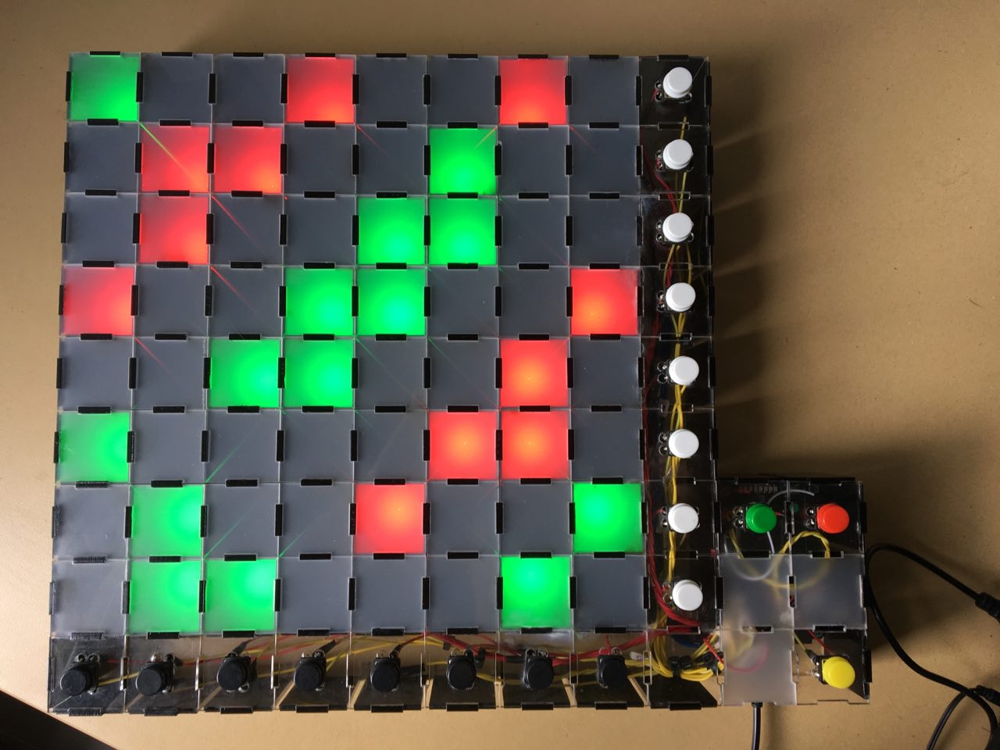

# Binary Sudoku
[Binary sudoku](http://www.binarysudokupuzzle.com/rules-binary-puzzle/) is a game that can be played on any `n x n` board, where `n` is an even positive integer. Each cell in the board contains either a `1` or `0`, and all cells must be filled, per the following constraints.

1. Each row and column must have an equal number of `1's` and `0's`.
1. There cannot be three consecutive `1's` or `0's`.
1. Each row and column are unique.

Following these three constraints yields a single unique solution per puzzle.

## About
The binary sudoku was built using the Mojo FPGA development board as part of a game design project spanning 8 weeks. Addressable LED strips were used as a user interface, with two colours: red and green. Each LED is covered with frosted acrylic, creating a diffused light effect.

    
    

 

Upon completion of the game, a relatively visually appealing colour display is shown. As I was very bored, four different light displays were created: a scrolling rainbow display, a shifting gradient display, a box colour display, and Conway's Game of Life.

    
    
    
    

